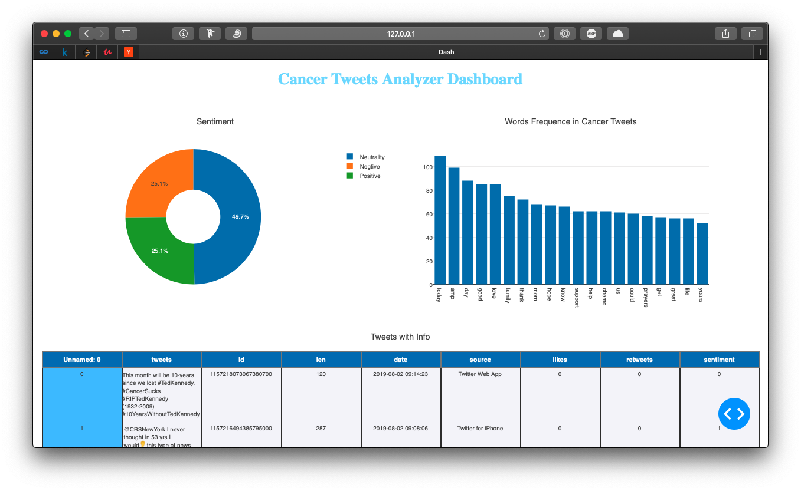

# CancerTweetsAnalysis

by Codegass.

To run the dashboard please run
`pip3 install dash dash-html-components dash-html-components`

Then change dir to this repo and run
`python3 ./dashborad.py`

Now you can open the browser and visit http://127.0.0.1:8050/ to see the dashboard.

## Structure

the whole algo has three parts:

First is for streaming the tweets under an list of keywords on time. The class working on this are `TwitterStreamer` & `TwitterListener`.

Second is for download the tweets and avoid the limit of the twitter api under a topic. The classes working on this are `TwitterClient` & `TweetAnalyzer`. The sentiment analysis is inside this class. The weights of the algo is pretained under wikipedia dictionary and transferred the weights by the cancersucks hashtag tweets.The basic analysis is based on Textblob with NLTK, but I motified the weight with our own training data.

Third is the dashboard. It plot all the data I got and give the different analyzers' results. This part is based on python package named as `Plotly`.

## Next Step

The Analyzer will be improved with time/location and emotional words to show the difference in people.

I will also design a new RNN algo for the reason and concern sentence capture.
